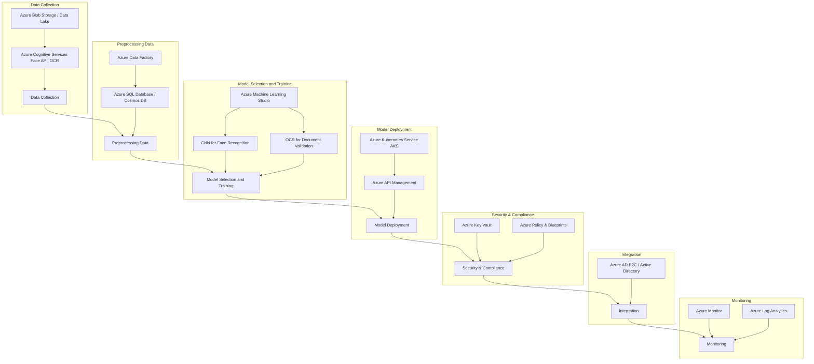

# Implementing-AI-Driven-Security-Solutions-for-Commercial-Banking-and-Financial-Institutions
Here's an Azure roadmap for each of the Machine Learning-based solutions you mentioned:

Certainly! Below are Mermaid diagrams for each of the four Machine Learning-based solutions you requested. You can use these diagrams in any Mermaid-compatible tool to visualize the workflows.

---

### 1. **Machine Learning-based Identity Verification**




---

#### **How to Use These Diagrams**

1. **Copy the Mermaid Code**: Select the Mermaid code block for the diagram you wish to view.
2. **Use a Mermaid Renderer**: Paste the code into a Mermaid-compatible tool or editor. Some popular options include:
   - [Mermaid Live Editor](https://mermaid.live/)
   - [Markdown Editors with Mermaid Support](https://www.markdownguide.org/tools/)
   - Integrated Development Environments (IDEs) like Visual Studio Code with Mermaid extensions.
3. **Visualize**: The tool will render the diagram based on the provided code, allowing you to visualize and modify it as needed.

Feel free to reach out if you need further customization or additional diagrams!

### 1. **Machine Learning-based Identity Verification**

1. **Data Collection**:
   - Xenhey will have a SFTP/API endpoint --> Azure Blob Storage to collect identity data (e.g., documents, images, or other personal data).
   - Use Azure Cognitive Services (Face API, OCR) to extract and validate personal details (like face matching, text extraction).

2. **Preprocessing Data**:
   - Use Xenhey to clean, normalize, and transform the data.
   - Store the preprocessed data in Azure SQL Database or Cosmos DB for structured data.

3. **Model Selection and Training**:
   - Use a  pre-trained models from Azure Machine Learning (AML) or train a new custom models using AML Studio.
   - Leverage algorithms such as Convolutional Neural Networks (CNN) for face recognition and Optical Character Recognition (OCR) for document validation.
   
4. **Model Deployment**:
   - Deploy models using Azure functions(Xenhey) for scalable, real-time verification.
   - Expose the model endpoints(Xenhey) via Azure API Management for integration with identity verification systems.

5. **Security & Compliance**:
   - Use Azure Key Vault to secure sensitive data like encryption keys and client secrets.
   - Enable Azure Policy and Azure Blueprints to maintain compliance (GDPR, HIPAA, etc.).

6. **Integration**:
   - Integrate the solution with existing identity platforms (Azure AD B2C or Active Directory) for identity verification workflows.
   
7. **Monitoring**:
   - Use Azure Monitor and Azure Log Analytics to track the performance and accuracy of identity verification models.

---

### 2. **Behavioral Biometrics Analysis**

```mermaid
graph TD
    A[Data Ingestion] --> B[Feature Engineering]
    B --> C[Model Training]
    C --> D[Model Testing]
    D --> E[Deployment]
    E --> F[Integration]
    F --> G[Monitoring & Optimization]

    subgraph Data Ingestion
        A1[IoT Devices / Applications]
        A2[Azure Blob Storage]
        A1 --> A2
        A2 --> A
    end

    subgraph Feature Engineering
        B1[Azure Data Factory]
        B2[Azure Databricks]
        B1 --> B2
        B2 --> B
    end

    subgraph Model Training
        C1[Azure Machine Learning]
        C2[RNN / LSTM Algorithms]
        C1 --> C2
        C2 --> C
    end

    subgraph Model Testing
        D1[AML Experimentation Tools]
        D1 --> D
    end

    subgraph Deployment
        E1[Azure Container Instances]
        E2[Azure Kubernetes Service (AKS)]
        E1 & E2 --> E
    end

    subgraph Integration
        F1[Azure AD / Azure AD B2C]
        F1 --> F
    end

    subgraph Monitoring & Optimization
        G1[Azure Monitor]
        G2[Azure Event Hubs]
        G1 & G2 --> G
    end
```


### 2. **Behavioral Biometrics Analysis**

1. **Data Ingestion**:
   - Collect behavioral data (e.g., keystrokes, typing patterns, mouse movements) via IoT devices or applications and store it in Azure Blob Storage(Xenhey).

2. **Feature Engineering**:
   - Use Xenhey to preprocess and extract features from behavioral data (such as typing speed, time between keystrokes).

3. **Model Training**:
   - Utilize Azure Machine Learning to build models based on behavioral biometrics using algorithms like Recurrent Neural Networks (RNN) or Long Short-Term Memory (LSTM) for time-series data analysis.
   
4. **Model Testing**:
   - Conduct testing and evaluation using AML’s experimentation tools to determine the accuracy and effectiveness of the model.

5. **Deployment**:
   - Deploy the trained models in Azure Container Instances or Azure Functions(Xenhey) for real-time analysis of behavioral patterns.
   
6. **Integration**:
   - Integrate with user authentication systems (Azure AD or Azure AD B2C) to use behavioral biometrics as a secondary authentication factor.

7. **Monitoring & Optimization**:
   - Leverage Azure Monitor to analyze model performance and set up alerts for abnormal behavior detection.
   - Use Azure Event Hubs to stream real-time behavioral data for continuous model retraining.

---

### 3. **AI-driven KYC (Know Your Customer) Enhancements**

```mermaid
graph TD
    A[Data Ingestion] --> B[Data Enrichment & Validation]
    B --> C[Model Development]
    C --> D[Customer Risk Profiling]
    D --> E[Automation with Azure Logic Apps]
    E --> F[Model Deployment]
    F --> G[Security]
    G --> H[Compliance]

    subgraph Data Ingestion
        A1[Azure Data Factory]
        A2[Azure Blob Storage / Data Lake]
        A1 --> A2
        A2 --> A
    end

    subgraph Data Enrichment & Validation
        B1[Azure Cognitive Services (Text Analytics, OCR)]
        B2[External APIs (Government Records)]
        B1 --> B2
        B2 --> B
    end

    subgraph Model Development
        C1[Azure Machine Learning]
        C2[Anomaly Detection Models]
        C3[Risk Scoring Models]
        C1 --> C2
        C1 --> C3
        C2 & C3 --> C
    end

    subgraph Customer Risk Profiling
        D1[AI Models]
        D2[Azure Synapse Analytics]
        D1 --> D2
        D2 --> D
    end

    subgraph Automation with Azure Logic Apps
        E1[Workflow Automation]
        E2[Integration with Onboarding Systems]
        E1 --> E2
        E2 --> E
    end

    subgraph Model Deployment
        F1[Azure Kubernetes Service (AKS)]
        F1 --> F
    end

    subgraph Security
        G1[Azure Key Vault]
        G2[Azure Security Center]
        G1 & G2 --> G
    end

    subgraph Compliance
        H1[Azure Blueprints]
        H2[KYC/AML Regulations]
        H1 & H2 --> H
    end
```


### 3. **AI-driven KYC (Know Your Customer) Enhancements**

1. **Data Ingestion**:
   - Ingest customer data from multiple sources (documents, transactions, etc.) using Xenhey and store in Azure Blob Storage or Data Lake.

2. **Data Enrichment & Validation**:
   - Use Azure Cognitive Services (Text Analytics, OCR) for document extraction and data enrichment.
   - Validate customer data by comparing it with external datasets via APIs (e.g., government records, experian, lexisnexis).

3. **Model Development**:
   - Use Azure Machine Learning to build models that evaluate KYC data for anomalies or mismatches, focusing on identity validation, risk scoring, and verification checks.

4. **Customer Risk Profiling**:
   - Leverage AI models to build risk profiles for customers based on historical data and behavioral patterns. Xenhey can be used for big data processing.

5. **Automation with Xenhey Orchestratiion WorkFlows**:
   - Automate workflows (e.g., flagging high-risk customers) using Xenhey and integrate them with customer onboarding systems.

6. **Model Deployment**:
   - Deploy KYC models using Azure Functions(Xenhey) to handle high-volume, real-time data processing.
   
7. **Security**:
   - Use Azure Key Vault for securely handling sensitive KYC data like PII and enable Azure Security Center for monitoring.

8. **Compliance**:
   - Implement compliance controls using Azure Blueprints for financial regulations such as KYC/AML (Anti-Money Laundering) compliance.

---

### 4. **Predictive Analytics for Fraud Detection**

```mermaid
graph TD
    A[Data Collection] --> B[Data Preparation & Processing]
    B --> C[Model Development]
    C --> D[Real-Time Fraud Detection]
    D --> E[Integration with Payment Systems]
    E --> F[Reporting & Analytics]
    F --> G[Monitoring & Feedback]
    G --> H[Security & Compliance]

    subgraph Data Collection
        A1[Azure Event Hubs]
        A2[Azure Data Lake / Blob Storage]
        A1 --> A2
        A2 --> A
    end

    subgraph Data Preparation & Processing
        B1[Azure Data Factory]
        B2[Data Cleansing & Anomaly Detection]
        B1 --> B2
        B2 --> B
    end

    subgraph Model Development
        C1[Azure Machine Learning]
        C2[Random Forest, Gradient Boosting, Neural Networks]
        C1 --> C2
        C2 --> C
    end

    subgraph Real-Time Fraud Detection
        D1[Azure Kubernetes Service (AKS)]
        D2[Azure Machine Learning Endpoints]
        D3[Azure Stream Analytics]
        D1 & D2 --> D3
        D3 --> D
    end

    subgraph Integration with Payment Systems
        E1[Azure API Management]
        E1 --> E
    end

    subgraph Reporting & Analytics
        F1[Power BI]
        F2[Azure Synapse Analytics]
        F1 & F2 --> F
    end

    subgraph Monitoring & Feedback
        G1[Azure Monitor]
        G2[Log Analytics]
        G3[Feedback Loops for Retraining]
        G1 & G2 & G3 --> G
    end

    subgraph Security & Compliance
        H1[Azure Key Vault]
        H2[Azure Policy & Blueprints (GDPR, PCI-DSS)]
        H1 & H2 --> H
    end
```


### 4. **Predictive Analytics for Fraud Detection**

1. **Data Collection**:
   - Use Azure Event Hubs to capture transactional and behavioral data in real-time from various sources such as online transactions, customer activities, and logs.
   - Store the data in Azure Data Lake or Blob Storage for large-scale analytics.

2. **Data Preparation & Processing**:
   - Use Xenhey to preprocess the data, perform cleansing, and detect anomalies or patterns in transaction history.

3. **Model Development**:
   - Train machine learning models in Azure Machine Learning using historical fraud data.
   - Algorithms like Random Forest, Gradient Boosting, and neural networks can be used for predictive fraud analytics.
   
4. **Real-Time Fraud Detection**:
   - Deploy real-time fraud detection models on Azure Functions Apps(Xenhey).
   - Integrate the solution with Azure Stream Analytics for real-time scoring and anomaly detection during customer transactions.

5. **Integration with Payment Systems**:
   - Integrate fraud detection models with existing payment gateways or transaction systems using Azure API Management --> Azure Function apps(Xenhey) for seamless detection and flagging.

6. **Reporting & Analytics**:
   - Use Power BI to create dashboards and reports for fraud patterns and predictive insights.
   - Azure Synapse Analytics can also be used for deep fraud pattern analysis across large datasets.

7. **Monitoring & Feedback**:
   - Use Azure Monitor and Log Analytics to continuously monitor model performance and adjust thresholds for fraud detection.
   - Use feedback loops from fraud investigations to retrain and optimize models.

8. **Security & Compliance**:
   - Implement data security using Azure Key Vault and compliance standards (GDPR, PCI-DSS) using Azure Policy and Azure Blueprints.

---

